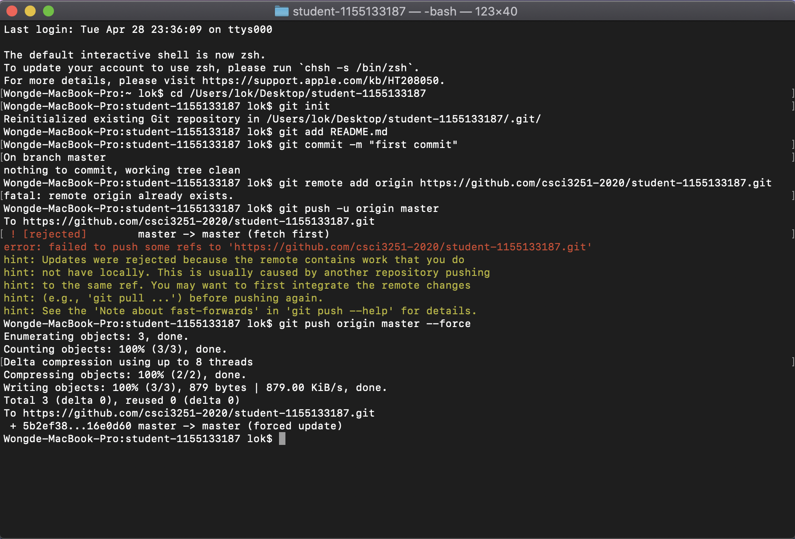

# Self-introduction

What's up! I'm Lok Wong, a currrently Year 3 student of Computer Science in CUHK. I am a novice in programming world and I have aquired much knowledge after attended a series of workshops in CSCI3251.

## Contents
* [Background](#background)
* [Language](#language)
    * [Natural](#natural)
    * [Programming](#programming)
* [Project Milestone](#project-milestone)
* [Screenshot](#screenshot)
* [Contributor](#contributor)

## Background
|Genre|Details
|---|---
|Full Name|Wong Tsz Lok
|Nick Name|Lok
|School|The Chinese University of Hong Kong
|Major|B.Sc. in Computer Science
|Year|3
|College|United College

## Language
### Natural
* Cantonese (First)
* English
* Mandarin

### Programming

#### Python
```python
print("Hello, World!")
```

#### Java
```java
public class HelloWorld {
    public static void main(String[] args) {
        System.out.println("Hello, World!");
    }

}
```

#### C++
```cpp
#include <iostream>
using namespace std;

int main() {
    cout << "Hello, World!";
    return 0;
}
```

## Project Milestone
- [x] Milestone #1
- [x] Milestone #2
- [X] Milestone #3

## Screenshot


## Contributor
- **Lok Wong** - [lokwongwtl](https://github.com/lokwongwtl)
